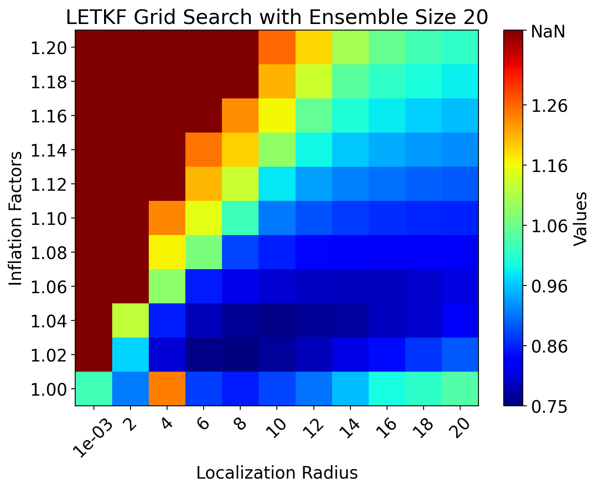
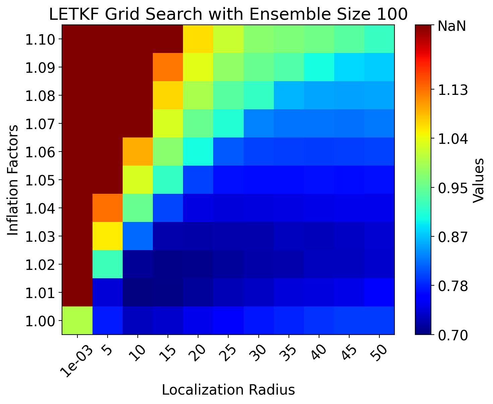

# DAPPER Grid Search

## Introduction

This project, DAPPER Grid Search, builds upon the [DAPPER (Data Assimilation with Python: a Package for Experimental Research)](https://github.com/nansencenter/DAPPER) framework. Its primary purpose is to perform hyperparameter grid searches for classic data assimilation methods implemented within DAPPER. This includes tuning crucial parameters such as inflation and localization.

To ensure the robustness and stability of our findings, each experimental setting within the grid search is executed across multiple trials. The results from these trials are then averaged. The grid search process is optimized to leverage CPU multiprocessing for enhanced computational efficiency.

The outcomes of this grid search were utilized in our research paper: "[Learning Enhanced Ensemble Filters](https://arxiv.org/abs/2504.17836)".

## Results Visualization

Below are example visualizations of the grid search results for the LETKF method applied to the 1D Kuramoto–Sivashinsky equation, showing performance across different hyperparameter settings. 

<table>
  <tr>
    <td align="center">
      
    </td>
    <td align="center">
      
    </td>
  </tr>
</table>

## Usage

Follow these steps to run the grid search:

1.  **Install DAPPER:**
    Ensure you have DAPPER version 1.7.0 installed.
    ```bash
    pip install dapper==1.7.0
    ```

2.  **Configure Parameters:**
    Set up your desired grid search parameters in the `grid_search_config.py` file. This includes defining the range of hyperparameters, the data assimilation methods, and the models to test.

3.  **Run the Grid Search:**
    Execute the main script to start the process.
    ```bash
    python grid_search.py
    ```
    The script will utilize multiprocessing to parallelize the experiments.

## Output

The results from the grid search experiments are saved in CSV format within the `save/` directory. An example filename would be `benchmarks_ks.csv`.

**Important:** The script includes a mechanism to avoid re-running completed experiments. If it detects that a specific grid search configuration (based on the parameters) has already been run and its results are present in the output CSV file, that particular configuration will be skipped.

---

*If you have any questions or encounter issues, please refer to the DAPPER documentation or open an issue in this repository.*